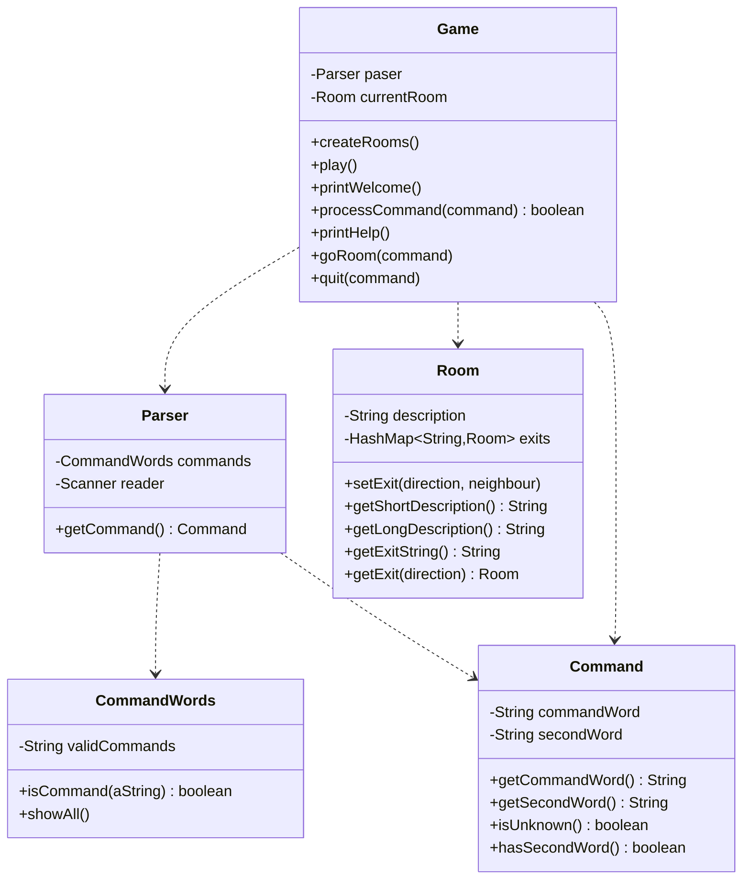
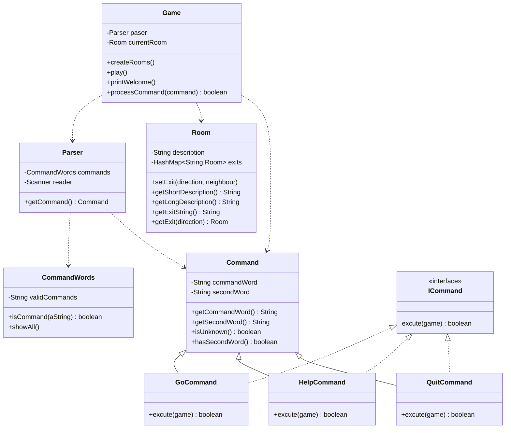
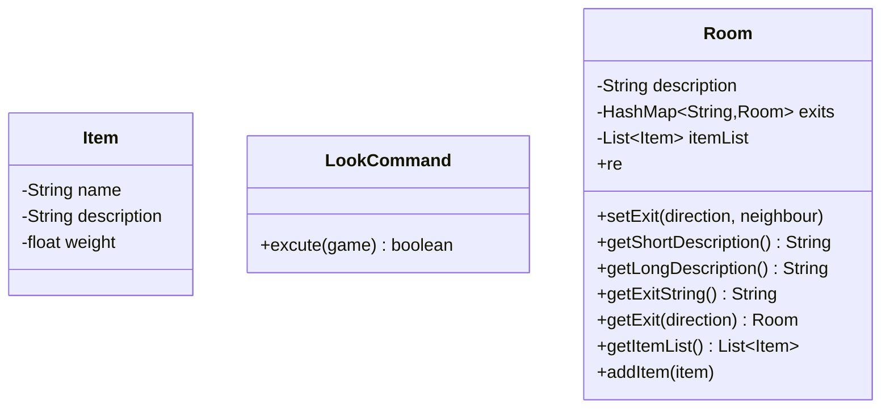
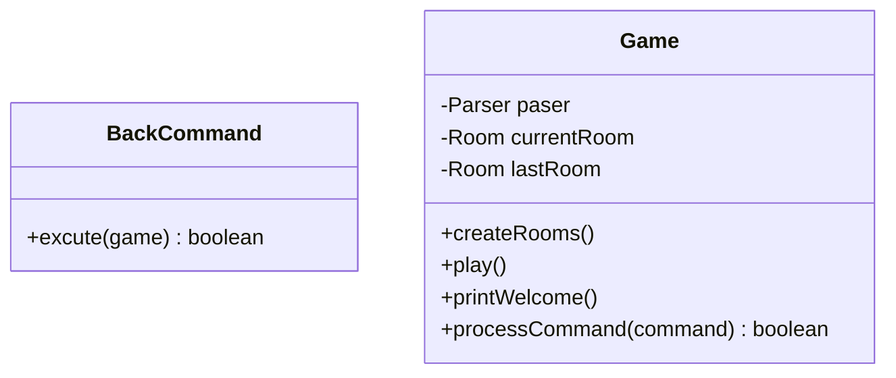
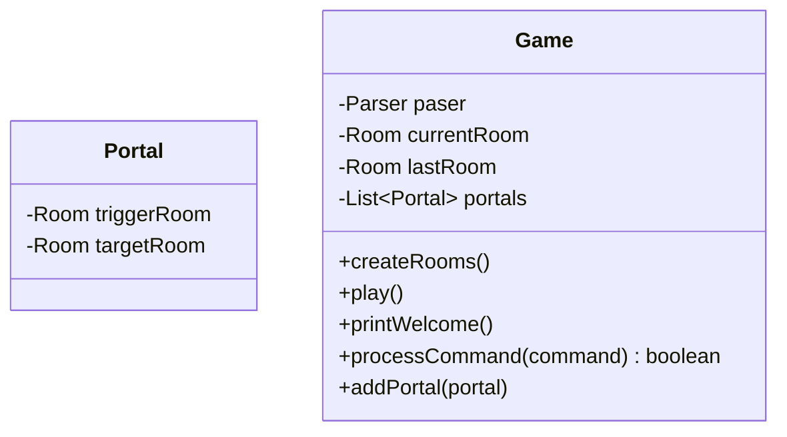
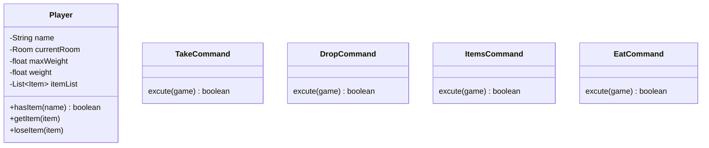
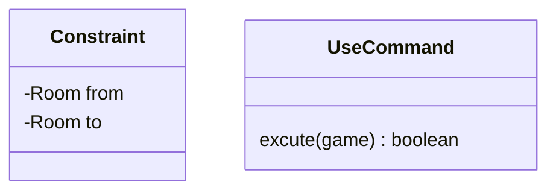

# 任务报告

## 1.阅读和描述代码结构

### 类功能描述

该样例工程包含以下几个类

- Game
- Room
- Parser
- Command
- CommandWords

Game类：包含游戏的主要逻辑和数据结构

Room类：游戏的场景，被划分为一个个房间

Parser类：从终端获取用户的输入，将输入解析为系统理解的命令

Command类：玩家输入被转换成命令发送到系统，系统根据命令做出响应

CommandWords类：保存有效的命令

### 样例工程代码结构-UML类图描述

## 2.改进功能说明

### 1.processCommand()方法

原本该方法通过多个else if识别command，调用合适的处理方法，这样非常不易添加命令，破坏了封装性。

将Game的处理命令的方法抽出来成为类，使用Java的反射机制，通过类名获取类GoCommand,HelpCommand,QuitCommand的实例，这些类统一实现ICommand接口，这样就可以通过excute()方法调用各自的实现。

改进后的类图：

### 2.一个房间里可以存放任意数量的物件，每个物件可以有一个描述和一个重量值，玩家进入一个房间后，可以通过“look”命令查看当前房间的信息以及房间内的所有物品信息

添加了类LookCommand, Item，给Room添加了新的属性

### 3.在游戏中实现一个“back”命令，玩家输入该命令后会把玩家带回上一个房间

添加了BackCommand类，给Game类添加了lastRoom属性和相关方法

### 4.在游戏中增加具有传输功能的房间，每当玩家进入这个房间，就会被随机地传输到另一个房间

添加了Portal类，给Game添加了portals属性

### 5.在游戏中新建一个独立的Player类用来表示玩家,一个玩家对象应该保存玩家的姓名等基本信息，也应该保存玩家当前所在的房间,玩家可以随身携带任意数量的物件，但随身物品的总重量不能操过某个上限值,在游戏中增加两个新的命令“take”和“drop”，使得玩家可以拾取房间内的指定物品或丢弃身上携带的某件或全部物品，当拾取新的物件时超过了玩家可携带的重量上限，系统应给出提示;在游戏中增加一个新的命令“items”, 可以打印出当前房间内所有的物件及总重量，以及玩家随身携带的所有物件及总重量;在某个或某些房间中增加一个物件，并增加一个“eat”命令，如果玩家找到并吃掉它，就可以增长玩家的负重能力

添加了TakeCommand, DropCommand, ItemsCommand, EatCommand, Player类

### 6.给门加“锁”，使玩家在满足一定条件之前无法通过。添加"use"命令，玩家可以使用一些物品，在正确的地方使用会产生效果如打开关闭的门，在错误的地方使用系统会提示

添加了Constraint, UseCommand类

Constraint类用于给门增加”锁“机制。

## 3.游戏地图

