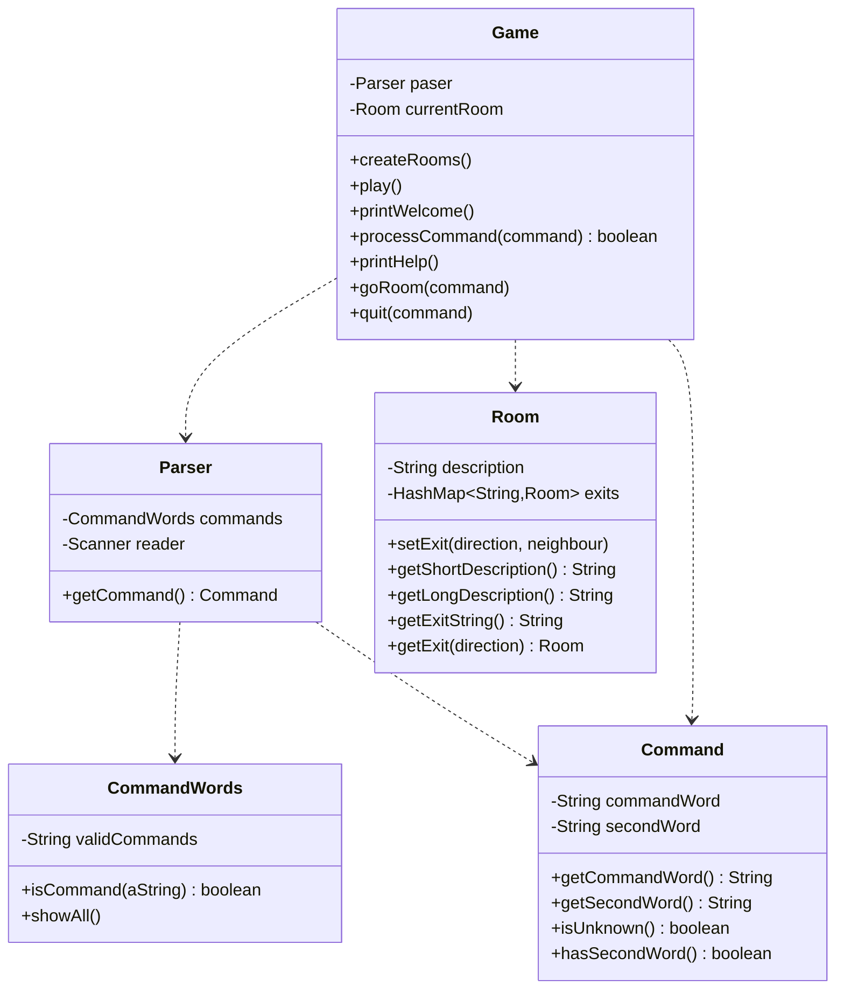

##### 样例工程代码结构-UML类图描述

```mermaid
classDiagram
class Parser {
	-CommandWords commands
	-Scanner reader
	+getCommand() Command
}
class CommandWords{
	-String validCommands
	+isCommand(aString) boolean
	+showAll()
}
class Command{
	-String commandWord
	-String secondWord
	+getCommandWord() String
	+getSecondWord() String
	+isUnknown() boolean
	+hasSecondWord() boolean
}
class Room{
	-String description
	-HashMap~String,Room~ exits
	+setExit(direction, neighbour)
	+getShortDescription() String
	+getLongDescription() String
	+getExitString() String
	+getExit(direction) Room
}
class Game{
	-Parser paser
	-Room currentRoom
	+createRooms()
	+play()
	+printWelcome()
	+processCommand(command) boolean
	+printHelp()
	+goRoom(command)
	+quit(command)
}
Parser ..> CommandWords
Game ..> Parser
Game ..> Room
Game ..> Command
Parser ..> Command
```

